# Yakit 使用指南（中文）

> 一份面向初学者、简单易懂的 Yakit 上手教程。内容整理自 [Yakit 官方文档](https://yaklang.com/) 与 [GitHub 官方仓库](https://github.com/yaklang/yakit)。
>
> 📸 **全程实测**：本指南把 Yakit 真正跑了起来，**28 张截图全部来自真实运行**（MITM 抓包/拦截、Web Fuzzer 发包与模糊测试、专项漏洞检测、DNSLog，以及 Yak Runner 中逐例执行的 11 段 Yaklang 代码），并非示意图。运行方法见 [§13](#13-运行与验证说明如何在离线环境跑起来)。
>
> 👤 **适合谁看**：刚接触 Yakit / 想从 BurpSuite 迁移 / 想学 Yaklang 脚本编程的安全初学者。
>
> ⚠️ **务必合法合规使用**，详见文末 [法律与合规声明](#14-法律与合规声明)。

---

## 目录

1. [Yakit 是什么](#1-yakit-是什么)
2. [核心架构：GUI + 引擎](#2-核心架构gui--引擎)
3. [下载与安装](#3-下载与安装)
4. [首次启动与连接引擎](#4-首次启动与连接引擎)
5. [核心功能速览](#5-核心功能速览)
6. [实战一：MITM 劫持（替代 BurpSuite）](#6-实战一mitm-劫持替代-burpsuite)
7. [实战二：Web Fuzzer 与 Fuzztag](#7-实战二web-fuzzer-与-fuzztag)
8. [实战三：插件商店与插件使用](#8-实战三插件商店与插件使用)
9. [实战四：专项漏洞扫描](#9-实战四专项漏洞扫描)
10. [实战五：Yak Runner 与 Yaklang 语法详解（含逐例截图）](#10-实战五yak-runner-与-yaklang-语法详解含逐例截图)
    - [10.0 打开 Yak Runner](#100-打开-yak-runner)
    - [10.1 变量、类型与格式化输出](#101-变量类型与格式化输出)
    - [10.2 数组（切片）与字典（map）](#102-数组切片与字典map)
    - [10.3 控制流：if / for / switch](#103-控制流if--for--switch)
    - [10.4 函数、多返回值与闭包](#104-函数多返回值与闭包)
    - [10.5 字符串处理与编码哈希（str / codec）](#105-字符串处理与编码哈希str--codec)
    - [10.6 错误处理与并发（try-catch / go / WaitGroup）](#106-错误处理与并发try-catch--go--waitgroup)
    - [10.7 发 HTTP 包：poc 库](#107-发-http-包poc-库)
    - [10.8 模糊测试：fuzz 库与 fuzztag](#108-模糊测试fuzz-库与-fuzztag)
    - [10.9 端口扫描与指纹识别：servicescan 库](#109-端口扫描与指纹识别servicescan-库)
    - [10.10 基础爬虫：crawler 库](#1010-基础爬虫crawler-库)
    - [10.11 与 GUI 联动：yakit 库](#1011-与-gui-联动yakit-库)
    - [10.12 Yaklang 语法速查表](#1012-yaklang-语法速查表)
11. [反连服务器（Reverse Server）](#11-反连服务器reverse-server)
12. [常见问题 FAQ](#12-常见问题-faq)
13. [运行与验证说明（如何在离线环境跑起来）](#13-运行与验证说明如何在离线环境跑起来)
14. [法律与合规声明](#14-法律与合规声明)
15. [参考链接](#15-参考链接)

---

## 1. Yakit 是什么

**Yakit** 是由 yaklang 团队开发的一款**网络安全一体化（ALL-IN-ONE）平台**，可以理解为「国产、开源、可编程的 BurpSuite」。它把渗透测试中常用的能力整合到一个图形化客户端里，覆盖从**抓包改包**到**漏洞挖掘**的完整流程：

- 🔍 **MITM 中间人劫持**：拦截、查看、修改 HTTP/HTTPS 流量，号称可 100% 替代 BurpSuite 的核心功能。
- ⚡ **Web Fuzzer**：全球首个**可视化** Web 模糊测试工具，支持爆破、Intruder、目录扫描等。
- 🧩 **插件生态**：内置插件商店，可一键安装社区插件，也支持自己编写 Yak 脚本插件。
- 🐞 **专项漏洞检测**：针对常见中间件、CMS、框架、组件的 PoC/EXP 批量扫描。
- 🔁 **反连服务器**：单端口多协议识别（HTTP/DNS/RMI/LDAP…）、反弹 Shell 接收、DNSLog。
- 🛠️ **Yak Runner**：内置专为安全设计的编程语言 **Yaklang（CDSL，网络安全领域专用语言）** 的代码编辑/运行环境。

Yakit 是**开源免费**的（GitHub 仓库 [yaklang/yakit](https://github.com/yaklang/yakit)），支持 **Windows / macOS / Linux** 三大平台。

---

## 2. 核心架构：GUI + 引擎

理解 Yakit 的架构是用好它的前提。Yakit 采用 **gRPC 的客户端-服务端（C/S）架构**，由两部分组成：

```
┌─────────────────────────┐        gRPC         ┌──────────────────────────┐
│      Yakit（GUI 客户端）   │  <───────────────>  │   yak 引擎（gRPC 服务端）    │
│  Electron 图形界面，负责展示 │     本地或远程连接      │  Yaklang 虚拟机，真正干活的核心  │
└─────────────────────────┘                     └──────────────────────────┘
```

- **Yakit（前端）**：你看到的图形界面，本身**不执行**扫描/抓包逻辑，只负责"下指令、看结果"。
- **yak 引擎（后端）**：一个独立的可执行文件（`yak`），内部是 Yaklang 的栈式虚拟机，所有抓包、扫描、Fuzz 都由它完成。
- 两者通过 **gRPC** 通信，因此引擎既可以**跑在本地**，也可以部署在**远程服务器**上，再用本地 Yakit 连过去。

> 💡 **关键点**：第一次启动 Yakit 时，如果本地没有引擎，它会提示你**下载/安装引擎**；之后每次启动都需要先「连接引擎」才能使用全部功能。

---

## 3. 下载与安装

### 3.1 官方下载地址

| 渠道 | 地址 |
| --- | --- |
| 官网下载页 | https://yaklang.com/products/download_and_install |
| GitHub Releases | https://github.com/yaklang/yakit/releases |

在 Releases 里按平台选择安装包（以 `v1.4.7-0605` 为例）：

| 平台 | 安装包文件名（示例） |
| --- | --- |
| Windows | `Yakit-1.4.7-0605-windows-amd64.exe` |
| macOS (Apple Silicon) | `Yakit-1.4.7-0605-darwin-arm64.dmg` |
| macOS (Intel) | `Yakit-1.4.7-0605-darwin-x64.dmg` |
| Linux | `Yakit-1.4.7-0605-linux-amd64.AppImage` |

> 🪟 **Windows 老旧系统 / 🍎 老旧 macOS / 🐧 老旧 Linux** 请选择带 `legacy` 字样的安装包。

### 3.2 各平台安装方式

- **Windows**：双击 `.exe` 安装包，按提示安装即可（普通用户安装，无需管理员）。
- **macOS**：打开 `.dmg`，把 Yakit 拖入「应用程序」。若提示"已损坏/无法验证开发者"，在「系统设置 → 隐私与安全性」点击"仍要打开"，或执行：
  ```bash
  sudo xattr -rd com.apple.quarantine /Applications/Yakit.app
  ```
- **Linux**：`.AppImage` 免安装，赋予可执行权限后直接运行：
  ```bash
  chmod +x Yakit-1.4.7-0605-linux-amd64.AppImage
  ./Yakit-1.4.7-0605-linux-amd64.AppImage --no-sandbox
  ```

---

## 4. 首次启动与连接引擎

第一次打开 Yakit，会经历下面几步（界面会自动引导）：

1. **同意用户协议**：阅读并勾选同意。
2. **安装/检测引擎**：
   - Yakit 检测本地是否已有 `yak` 引擎。没有时会弹出**「安装引擎」**按钮，点一下自动下载（默认从官方源下载，国内有镜像）。
   - 引擎默认安装在用户目录下的 `yakit-projects/yak-engine/yak`。
3. **启动并连接引擎**：
   - 下载完成后点击 **「启动引擎」/「本地连接」**，Yakit 会在本地拉起 `yak grpc` 服务并自动连上。
   - 也可以选择 **「远程连接」**，填写远程引擎的 `Host / Port / 证书 / 密钥` 来连接部署在服务器上的引擎。
4. **进入主界面**：连接成功后即可看到顶部菜单栏（安全工具、MITM、Web Fuzzer、插件、Yak Runner 等）。

首次启动的**主题/模式选择与连接引擎**界面如下，点击橙色 **「手动连接引擎」**（或等待自动连接）即可：


连接成功后进入**项目管理**：每个"项目"对应一个独立数据库（SQLite），流量与扫描结果隔离存储。标题栏显示 `Yakit-本地模式`，已连接本地引擎：


> 🛠️ **手动启动引擎（进阶 / 离线环境）**
> 如果你已经单独下载了 `yak` 引擎二进制，可以手动启动 gRPC 服务，再让 Yakit「远程连接 / 本地连接」到它：
> ```bash
> # 赋权
> chmod +x ./yak
> # 启动 gRPC 服务（默认端口 8087），首次会初始化本地数据库
> ./yak grpc --host 127.0.0.1 --port 8087
> ```
> 本指南末尾的[测试截图](#13-测试截图在本环境运行-yakit)就是用这种方式在受限网络环境中把引擎跑起来的。

---

## 5. 核心功能速览

启动后，顶部/侧边的主要功能区如下（不同版本菜单略有差异）：

| 模块 | 作用 | 类比 BurpSuite |
| --- | --- | --- |
| **MITM 交互式劫持** | 抓包、改包、放行、历史流量 | Proxy + Intercept |
| **History（历史）** | 所有经过代理的请求列表，可检索、回放 | HTTP history |
| **Web Fuzzer** | 自定义原始请求 + 模糊测试/爆破 | Repeater + Intruder |
| **插件商店 / 本地插件** | 安装、运行、管理 Yak 插件 | Extensions/BApp |
| **专项漏洞检测** | 中间件/CMS/框架 PoC 批量扫描 | 主动扫描 |
| **端口/资产扫描** | 端口扫描、指纹识别、空间引擎 | — |
| **反连服务器** | DNSLog、反弹 Shell、协议识别 | Collaborator |
| **Yak Runner** | 编写运行 Yaklang 脚本 | — |
| **Payload 字典** | 管理爆破字典 | Payloads |

进入项目后的**主界面（首页 Dashboard）**——顶部是功能菜单，中间是各模块入口卡片，右下角可见 **本地插件 37 个**（说明引擎已离线就绪）：


---

## 6. 实战一：MITM 劫持（替代 BurpSuite）

MITM（中间人）是 Yakit 最常用的功能：它在本地启动一个 HTTP 代理，浏览器流量经过它时即可被拦截、查看、修改。

### 6.1 启动 MITM 代理

1. 顶部菜单进入 **「MITM 交互式劫持」**。
2. 设置 **劫持代理监听地址**，默认 `127.0.0.1:8083`（端口可改）。
3. 点击 **「劫持已开启 / 启动」**。

MITM 配置页如下：右侧设置监听主机/端口、下游代理、HTTPS 配置等；左侧可勾选**被动扫描插件**（SQL 注入、XSS、命令注入、文件包含等，共 17 个）。底部点 **「劫持启动」**，或 **「免配置启动」** 一键拉起带好代理与证书的 Chrome：


启动后进入劫持运行界面，标题显示 `劫持 HTTP Request 127.0.0.1:8083`，可在 **手动劫持 / 自动放行** 之间切换：


### 6.2 安装 CA 证书（解密 HTTPS）

要抓 HTTPS 流量，浏览器需要信任 Yakit 的 CA 证书。两种方式：

- ✅ **免配置启动（推荐新手）**：Yakit 提供"免配置启动 Chrome"功能（MITM 页面 → 右上角浏览器图标），它会拉起一个**已自动信任证书、已设置好代理**的临时 Chrome，开箱即用，无需手动装证书。
- 🔧 **手动安装证书**：
  1. 在 MITM 劫持页的「**高级配置 / 下载证书**」处下载 CA 证书（`.crt`）。
  2. Windows：双击证书 → 安装到 **「受信任的根证书颁发机构」**。
  3. macOS：导入「钥匙串」并设为「始终信任」。
  4. 浏览器/系统设置 HTTP 代理为 `127.0.0.1:8083`（与上一步监听端口一致）。

### 6.3 拦截 → 放行 → 历史

- **拦截（Hijack）**：开启劫持后，每个请求会被"挂起"，你可以在请求框里直接编辑，然后：
  - **放行（Forward）**：转发当前这个包。
  - **丢弃（Drop）**：丢掉这个包。
  - **放行所有 / 自动放行**：暂停手动拦截，让流量自动通过（这时相当于被动记录模式）。
- **History（历史记录）**：所有经过代理的请求都会记录在下方列表，支持按 URL、状态码、关键字过滤检索，点开可看完整请求/响应。

**实测演示：** 在「自动放行」模式下让流量经过代理（这里用 `curl -x http://127.0.0.1:8083 ...` 访问本地靶子），所有请求都被记录下来，含方法、状态码、URL、Host、Path：


切换到 **「手动劫持」** 后，再来一个请求就会被**挂起拦截**，下方可直接编辑这个原始报文（图中拦下的是带自定义 `X-Demo` 头的 `GET /admin?id=1&user=test`），然后选择 **放行 / 丢弃 / 劫持响应 / 发到 FUZZ**：

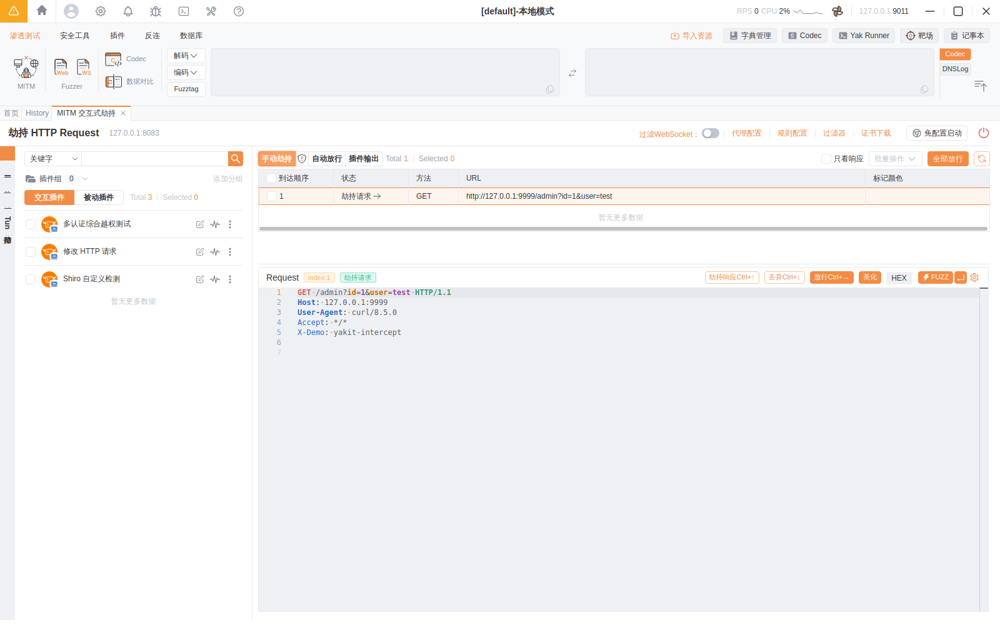

所有经过代理的流量都会进入 **History**，左侧按站点分组，支持状态码/关键字/高级筛选：

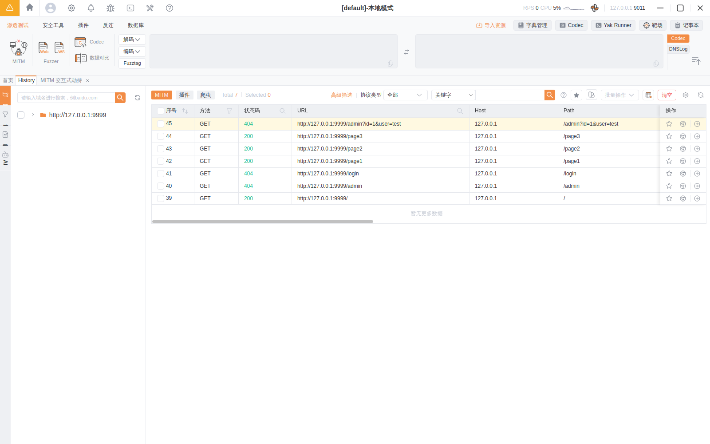

### 6.4 三个高频进阶能力

- **替换规则 / 标记（Replacer）**：用正则自动替换请求或响应中的内容（如统一替换 Header、给响应染色标记），便于批量处理与定位。
- **热加载（Hot-loading）**：在 MITM 页面直接写一段 Yak 脚本，对**每个**经过的请求/响应做自定义处理（如自动解密、自动加签名），改完即生效，无需重启。
- **被动扫描插件**：在 MITM 开启时挂载被动扫描插件，浏览网站的同时自动对流量做漏洞检测。

### 6.5 发送到 Web Fuzzer

在 History 或拦截框里，右键某个请求 → **「发送到 Web Fuzzer」**，即可把这个请求丢进 Fuzzer 做进一步的重放和爆破（见下一节）。这就是经典的 **拦截 → History → Repeater/Intruder** 工作流。

---

## 7. 实战二：Web Fuzzer 与 Fuzztag

Web Fuzzer 是 Yakit 的"杀手锏"，把 BurpSuite 的 Repeater（重放）和 Intruder（爆破）合二为一，而且是**可视化**的。

### 7.1 基本用法（重放）

1. 进入 **「Web Fuzzer」**，左侧粘贴/编辑一个**原始 HTTP 请求**（Raw 报文）。
2. 点击 **「发送」**，右侧立刻显示响应。
3. 引擎会**自动修复** `Content-Length`、`Content-Type`、`CRLF`、分块编码等细节，你专注改 payload 即可。

Web Fuzzer 的界面：左侧编辑请求，右侧显示响应，顶部有 `强制 HTTPS`、`热加载`、`构造请求`、`爆破示例` 等：


**实测单次发包**：把请求指向本地靶子并点「发送」，右侧真实返回 `HTTP/1.0 200 OK` 与响应体，并显示耗时（5ms）与远端地址：


### 7.2 Fuzztag：可视化模糊测试的核心语法

Fuzztag 用 `{{...}}` 包裹，发送时会被**自动展开**成多个请求。常用标签：

| Fuzztag | 含义 | 示例展开 |
| --- | --- | --- |
| `{{int(1-100)}}` | 数字遍历（如遍历 ID） | 1,2,3,…,100 |
| `{{int(1-100\|4)}}` | 数字遍历并补零到 4 位 | 0001,0002,… |
| `{{file(/path/dict.txt)}}` | 从字典文件逐行取值 | 字典里的每一行 |
| `{{x(payload名)}}` | 引用 Payload 字典 | 字典内容 |
| `{{net(192.168.1.1/24)}}` | IP 段遍历 | 各个 IP |
| `{{rand_int(1,100)}}` | 随机数 | 随机 |
| `{{base64(...)}}` | 对内容做 base64 编码 | 编码后的串 |
| `{{date()}}` | 当前时间 | 时间戳 |

**典型场景：**

- **爆破登录密码**：把请求体里的密码改成
  ```
  password={{file(/path/to/passwords.txt)}}
  ```
  发送后，每行字典各发一个请求，在结果表里按**响应长度/状态码**排序即可发现异常项。

- **遍历越权 ID（IDOR）**：
  ```
  GET /api/user/{{int(1000-1100)}} HTTP/1.1
  ```

- **多参数笛卡尔积**：同时给用户名和密码加 Fuzztag，Yakit 会自动做笛卡尔积组合，相当于 Intruder 的 Cluster Bomb 模式。

### 7.3 结果分析

发送后下方是结果表格，可按 **响应状态码、响应长度、耗时、关键字匹配** 排序和过滤，快速定位"与众不同"的响应——这通常就是漏洞点或正确凭据。

**实测模糊测试**：把路径写成 `GET /page{{int(1-5)}}`（Yakit 会高亮识别 fuzztag），点「发送请求」后自动展开成 5 个请求并发出，结果表里每行对应一个 payload，可见 **状态码 / 响应大小 / 延迟(ms) / Payloads** 等列，点列头即可排序找异常项（这就是 BurpSuite Intruder 的可视化版）：


---

## 8. 实战三：插件商店与插件使用

Yakit 的能力很大一部分来自插件（用 Yaklang 编写）。

1. 进入 **「插件商店」**，可以浏览、搜索社区插件，点击 **「下载/安装」**。
2. 已安装插件在 **「本地插件 / 我的插件」** 里管理。
3. 插件分几类：
   - **MITM/被动扫描插件**：挂在 MITM 上自动检测。
   - **端口扫描/指纹插件**：识别资产与组件。
   - **PoC/漏洞插件**：针对特定漏洞做检测/利用。
4. 也可以点 **「新建插件」** 自己写一个，支持热加载调试。

引擎自带了一批**本地插件**（开箱即用、离线可用）。在 **「插件 → 批量执行」** 里可以勾选这些本地插件、填入扫描目标后批量执行：


> ⚠️ 在受限网络环境（无法访问插件源）下，**在线插件商店**会提示 `Host not in allowlist / 连网后才可访问 Yakit 插件商店`（如下图），但**本地内置插件与功能（MITM、Web Fuzzer、Yak Runner、本地 PoC）完全不受影响**。本指南正是在这种离线环境下完成全部实测的。


---

## 9. 实战四：专项漏洞扫描

Yakit 的「专项漏洞检测」针对常见目标做精准 PoC 扫描：

1. 进入 **「专项漏洞检测 / 漏洞检测」** 模块。
2. 输入目标（URL / IP / 资产列表）。
3. 选择要使用的 PoC 类型（按中间件、CMS、框架、组件筛选，例如 Shiro、Struts2、Weblogic、Log4j 等）。
4. 点击开始，结果会列出命中的漏洞与详情，可导出报告。

「安全工具 → 专项漏洞检测」页面如下：左侧按 **类别**（Java、SQL 注入、远程代码执行、Shiro、FastJSON、Spring、IIS、XSS、PHP、安全产品…）列出 PoC 插件组，右侧填入扫描目标即可批量检测：


> 也可结合「端口/资产扫描」先做资产测绘（端口、服务指纹、Web 指纹），再针对性地选 PoC 扫描。

---

## 10. 实战五：Yak Runner 与 Yaklang 语法详解（含逐例截图）

**Yaklang（简称 Yak）** 是 Yakit 内置的、专为网络安全设计的编程语言（CDSL）。语法**像 Go + Python**：写法简洁、强类型但能自动推断，并且内置了海量安全相关标准库（`poc`、`fuzz`、`servicescan`、`crawler`、`codec`、`str` …）。

**Yak Runner** 就是 Yakit 里的「在线 IDE」：写代码、语法检查、一键运行、看输出，全部在 GUI 里完成。

> 📌 本章每个例子都**真实运行过**，下方截图均为 Yak Runner 的实际执行结果（代码区 + 底部「输出」面板）。所有脚本也已放在仓库 **[`examples/yak/`](examples/yak/)** 目录里，可直接下载运行。你也可以用引擎命令行运行同样的脚本（等价）：
> ```bash
> ./yak 你的脚本.yak        # 注意：是 yak <文件>，不是 yak run <文件>
> ```
> 其中 `06`~`11` 的网络示例默认请求 `http://127.0.0.1:9999`，运行前可先起个靶子：`python3 -m http.server 9999`。

---

### 10.0 打开 Yak Runner

顶部菜单点击 **「Yak Runner」**，进入欢迎页，再点 **「新建文件」** 即可得到一个 `.yak` 代码编辑器；右上角橙色 **「执行」** 按钮用来运行，底部状态栏有 **语法检查 / 终端 / 输出** 面板。


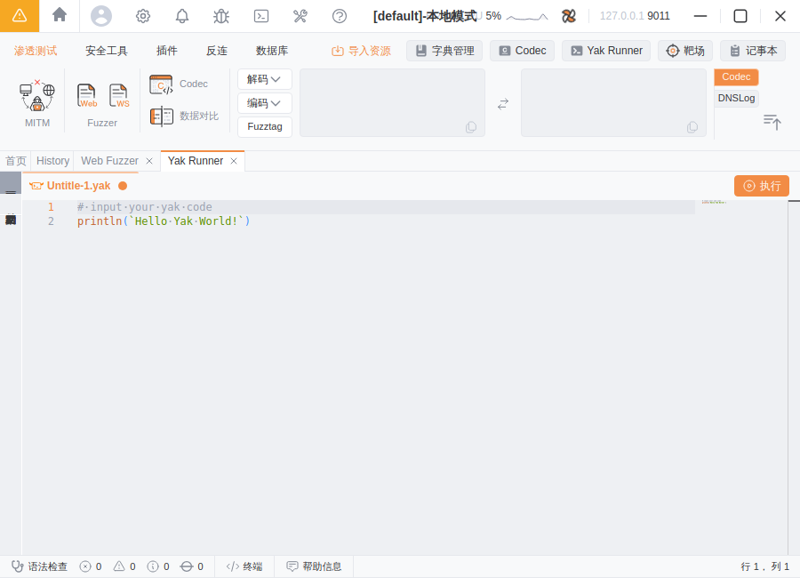

---

### 10.1 变量、类型与格式化输出

变量无需声明类型，直接赋值即可（自动推断）。`println` 直接打印，`printf` 支持 `%s/%d/%v/%.1f` 等占位符；`typeof(x)` 查看类型。

```go
name = "Yakit"          // 字符串
version = 1.4           // 浮点数
count = 37              // 整数
enabled = true          // 布尔值

printf("欢迎使用 %s，版本 %.1f\n", name, version)
println("内置插件数量:", count)
println("name 的类型是:", typeof(name))   // string
println("count 的类型是:", typeof(count)) // int
```

运行结果（输出面板）：

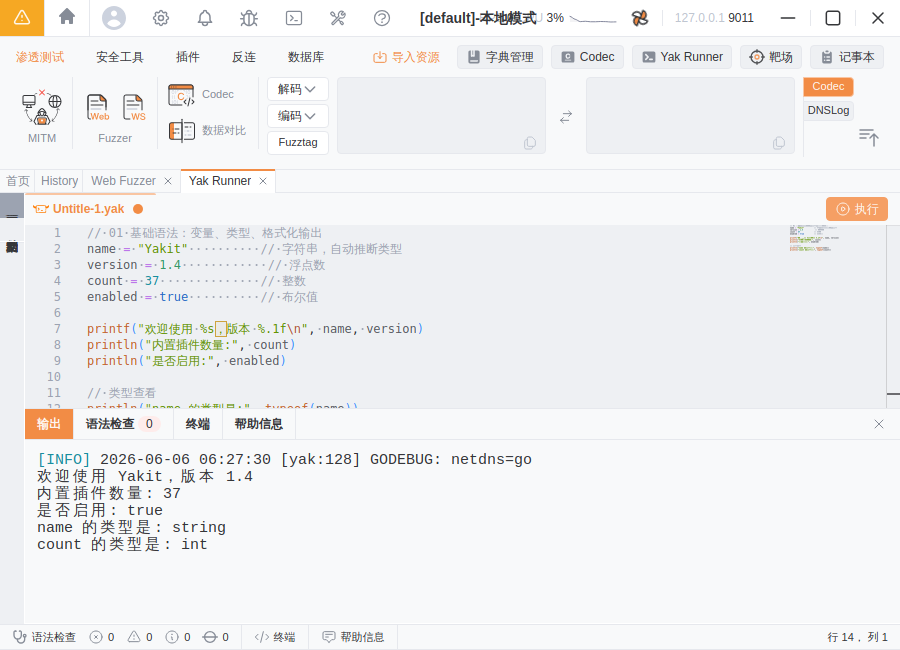

---

### 10.2 数组（切片）与字典（map）

切片用 `[]` 定义，`append()` 追加，`len()` 取长度；map 用 `{}` 定义。

> ⚠️ **遍历的坑（重点）**：Yaklang 中 `for e in 切片` 拿到的是**元素本身**；对切片用 `for i, e in 切片` 的双变量写法**不会**给你“下标+值”。要带下标请用 C 风格 `for i=0; i<len(s); i++`。而对 **map** 用 `for k, v in m` 才是正常的“键, 值”。

```go
ports = [80, 443, 8080, 3306]
ports = append(ports, 6379)        // 追加
println("长度:", len(ports))
for port in ports {                // 单变量 = 元素
    printf("  端口 %v\n", port)
}

service = {"80": "http", "443": "https", "3306": "mysql"}
println("443 对应:", service["443"])
for port, name in service {        // map：键, 值
    printf("  %v => %v\n", port, name)
}
```

运行结果：

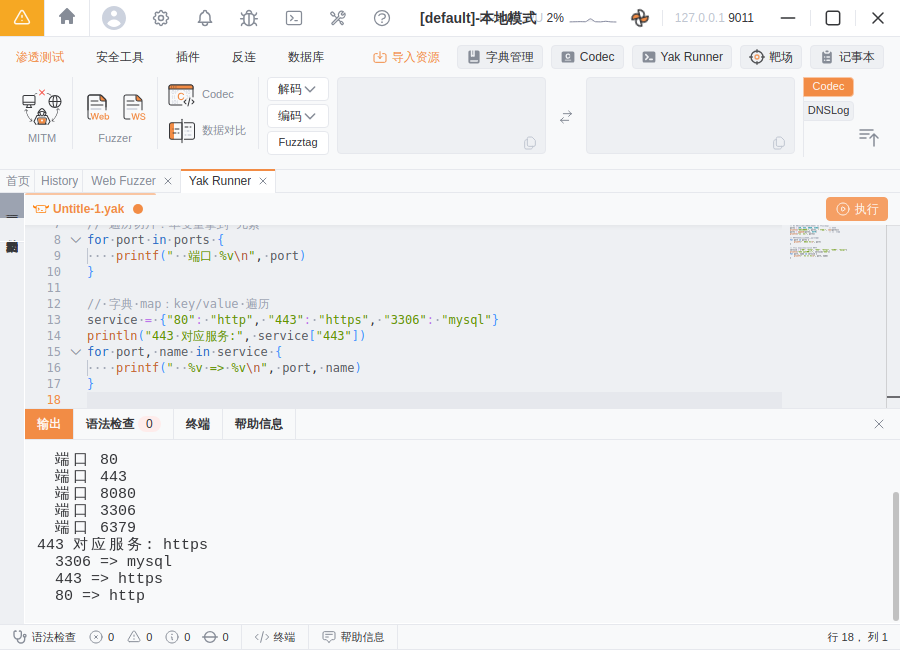

---

### 10.3 控制流：if / for / switch

> ⚠️ Yaklang 的 `for ... in` **不支持** `1..5` 或 `range(n)` 这种写法，数字循环请用 **C 风格** `for i=1; i<=5; i++`。

```go
for i = 1; i <= 5; i++ {
    if i % 2 == 0 {
        printf("%d 是偶数\n", i)
    } else {
        printf("%d 是奇数\n", i)
    }
}

code = 404
switch code {
case 200: println("请求成功")
case 404: println("页面不存在")
default:  println("其他状态码")
}
```

运行结果：

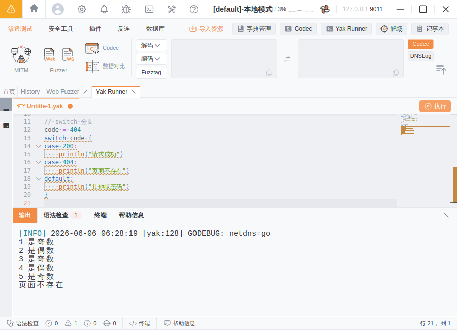

---

### 10.4 函数、多返回值与闭包

用 `func` 定义函数，支持**多返回值**和**匿名函数（闭包）**。

```go
func add(a, b) { return a + b }

func divmod(a, b) {             // 多返回值
    return a / b, a % b
}
q, r = divmod(17, 5)           // 一次接收多个返回值
printf("17 / 5 = %d 余 %d\n", q, r)

square = func(x) { return x * x }   // 匿名函数赋给变量
println("square(9) =", square(9))
```

运行结果：

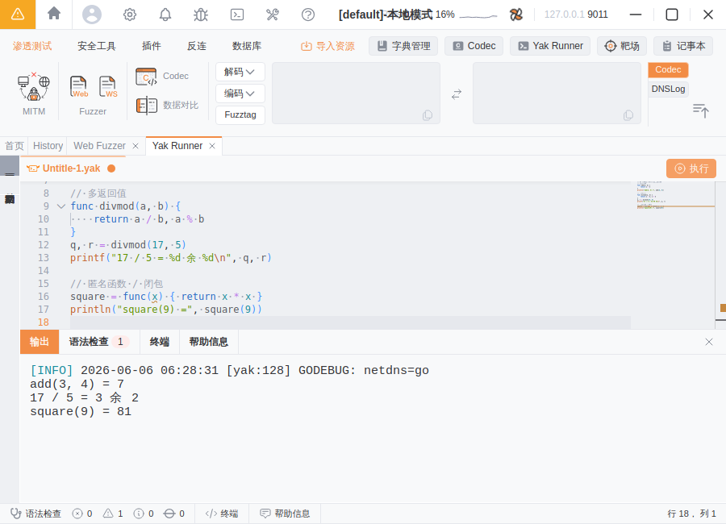

---

### 10.5 字符串处理与编码哈希（str / codec）

`str.*` 提供字符串处理，`codec.*` 提供编码/解码/哈希——这两个库在渗透中极其常用。

```go
raw = "  Hello, Yakit Security  "
println("去空格:", str.TrimSpace(raw))
println("大写:",   str.ToUpper(str.TrimSpace(raw)))
println("包含?",   str.Contains(raw, "Yakit"))
println("分割:",   str.Split("a,b,c,d", ","))

data = "admin:123456"
println("Base64:", codec.EncodeBase64(data))
println("MD5   :", codec.Md5(data))
println("URL   :", codec.EncodeUrl(data))
```

运行结果（可见 Base64/MD5/URL 编码结果）：

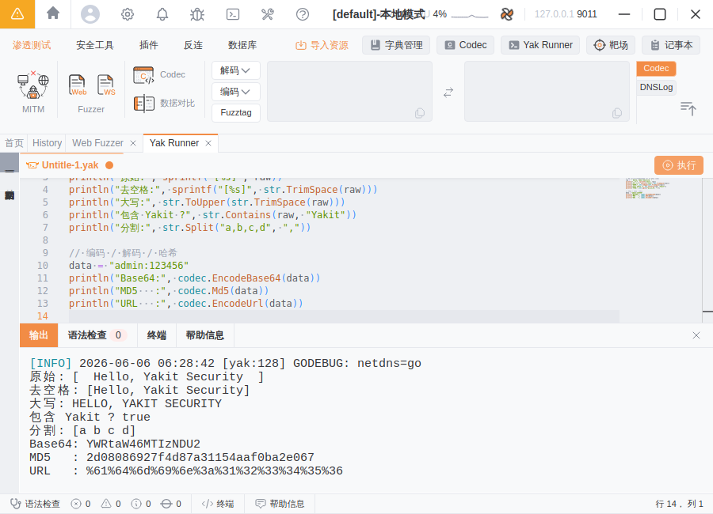

---

### 10.6 错误处理与并发（try-catch / go / WaitGroup）

Yaklang 既支持 Go 风格的 `err` 返回值判断，也支持 `try { } catch e { }`；并发用 `go` 关键字 + `sync.NewWaitGroup()`。

```go
rsp, req, err = poc.Get("http://127.0.0.1:9999/")
if err != nil { die(err) }              // die 直接终止并打印错误
println("状态码:", rsp.GetStatusCode())

try {
    x = 10 / 0
} catch e {
    println("已捕获异常:", e)            // runtime error: integer divide by zero
}

wg = sync.NewWaitGroup()
for i = 0; i < 3; i++ {
    wg.Add(1)
    go func(n) {
        defer wg.Done()
        printf("  并发任务 #%d 执行完毕\n", n)
    }(i)
}
wg.Wait()
println("全部并发任务结束")
```

运行结果：

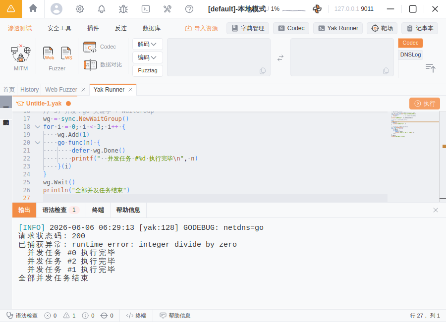

---

### 10.7 发 HTTP 包：poc 库

`poc` 是渗透测试**最常用**的发包库。`poc.Get / poc.Post` 用 URL 发包，`poc.HTTP` 直接发送**原始报文**（适合改包/构造畸形包）。

```go
// 用 URL 发 GET，并带上选项
rsp, req, err = poc.Get("http://127.0.0.1:9999/",
    poc.timeout(5),
    poc.https(false),
)
if err != nil { die(err) }
println("状态码 :", rsp.GetStatusCode())
println("Server :", rsp.GetHeader("Server"))
println("响应体长度:", len(rsp.GetBody()))

// 直接发送原始 HTTP 报文
raw = `GET /admin HTTP/1.1
Host: 127.0.0.1:9999
User-Agent: yak-poc

`
rsp2, _, _ = poc.HTTP(raw)
println(string(rsp2)[:60])    // 打印响应前 60 字节
```

运行结果（真实拿到 `200`、`Server` 头与响应长度）：

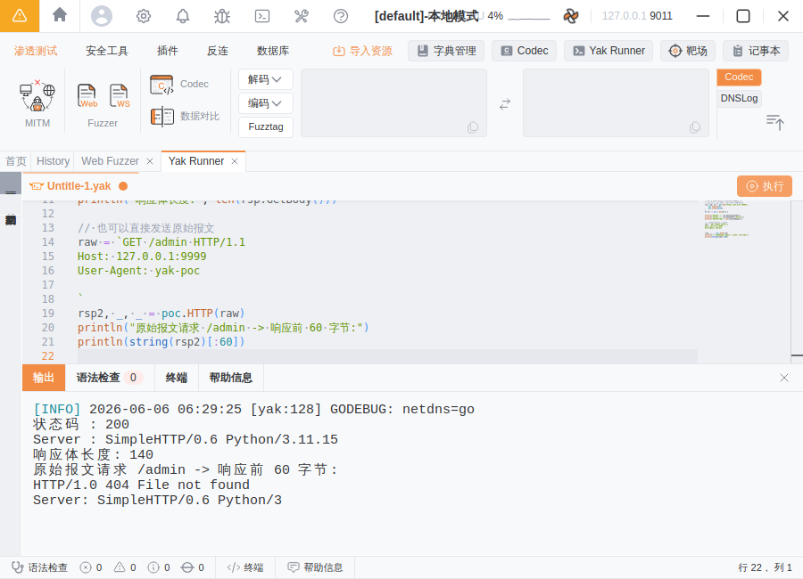

---

### 10.8 模糊测试：fuzz 库与 fuzztag

`fuzz` 库是 Web Fuzzer 的“代码版”。`fuzz.Strings("{{...}}")` 渲染 fuzztag；`fuzz.MustHTTPRequest(...).FuzzPath("/x{{int(1-3)}}").Exec()` 可对路径批量发包。

```go
// 1) fuzztag 渲染
println("数字遍历:", fuzz.Strings("admin_{{int(1-3)}}"))   // [admin_1 admin_2 admin_3]
println("列表遍历:", fuzz.Strings("{{list(GET|POST|PUT)}}"))// [GET POST PUT]

// 2) 对真实请求的路径做 fuzz 并发包
freq = fuzz.MustHTTPRequest("GET / HTTP/1.1\r\nHost: 127.0.0.1:9999\r\n\r\n")
ch, err = freq.FuzzPath("/page{{int(1-3)}}").Exec()
if err != nil { die(err) }
n = 0
for result in ch {
    n++
    code = poc.GetStatusCodeFromResponse(result.ResponseRaw)
    printf("  第%d个请求 -> 状态码 %v, 响应 %d 字节\n", n, code, len(result.ResponseRaw))
}
printf("Fuzz 共发送 %d 个请求\n", n)
```

运行结果（fuzztag 展开 + 真实发出 3 个请求）：

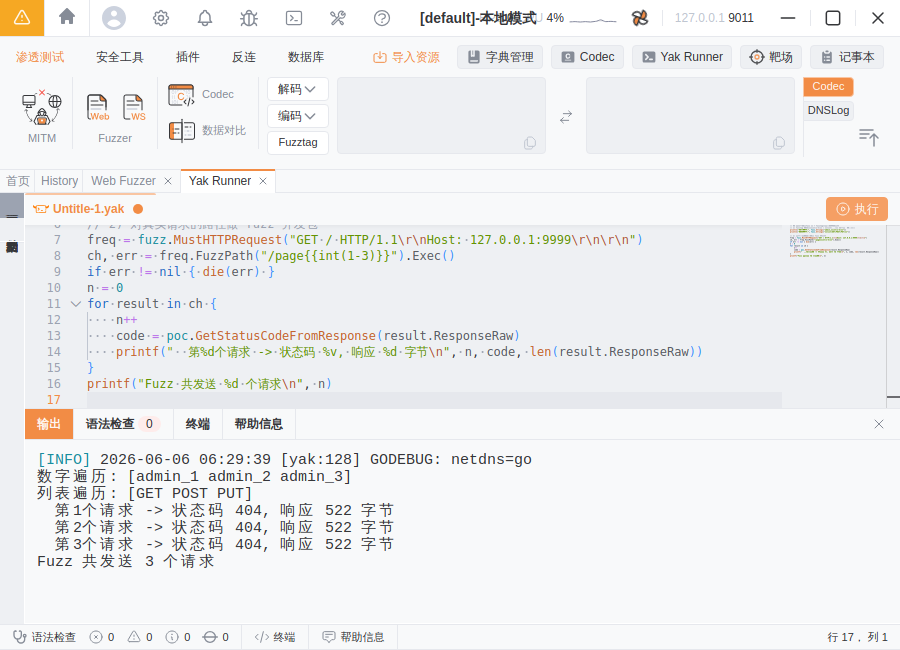

---

### 10.9 端口扫描与指纹识别：servicescan 库

`servicescan.Scan(host, ports)` 在扫描端口的同时**识别服务/组件指纹**。

```go
res, err = servicescan.Scan("127.0.0.1", "9999")
if err != nil { die(err) }
for result in res {
    println("扫描结果:", result.String())   // 含地址+状态+指纹
    println("  目标:", result.Target, " 端口:", result.Port, " 状态:", result.State)
}
```

运行结果（成功识别出 `http/python/simplehttp` 指纹）：

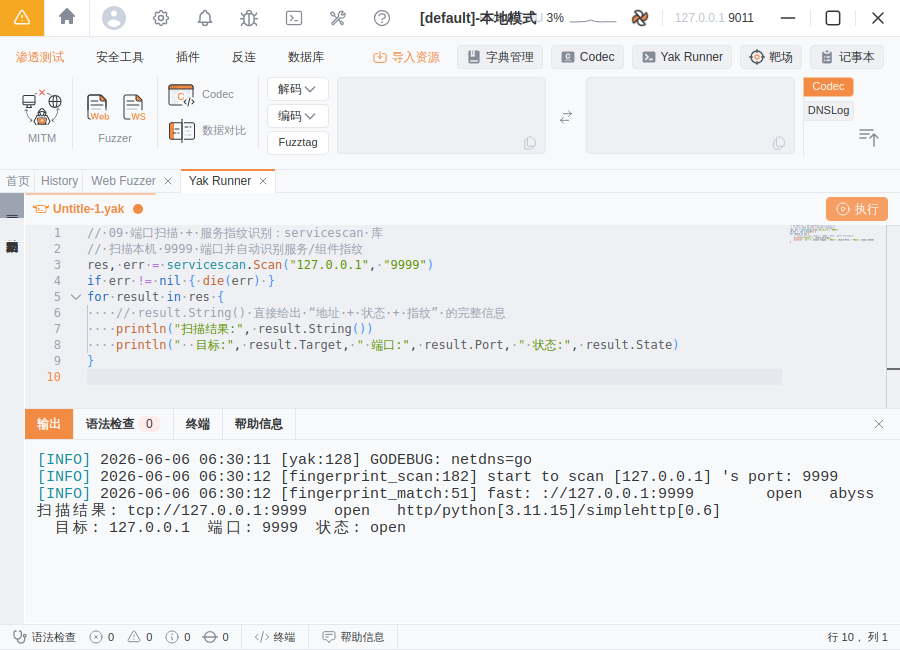

---

### 10.10 基础爬虫：crawler 库

`crawler.Start(url, crawler.maxDepth(n))` 启动爬虫，`for req in manager` 拿到每个发现的请求。

```go
manager, err = crawler.Start("http://127.0.0.1:9999/", crawler.maxDepth(2))
if err != nil { die(err) }
count = 0
for req in manager {
    count++
    printf("[爬虫] %s %s\n", req.Request().Method, req.Url())
}
printf("共爬取到 %d 个 URL\n", count)
```

运行结果（自动发现 `/`、`/admin`、`/login`）：

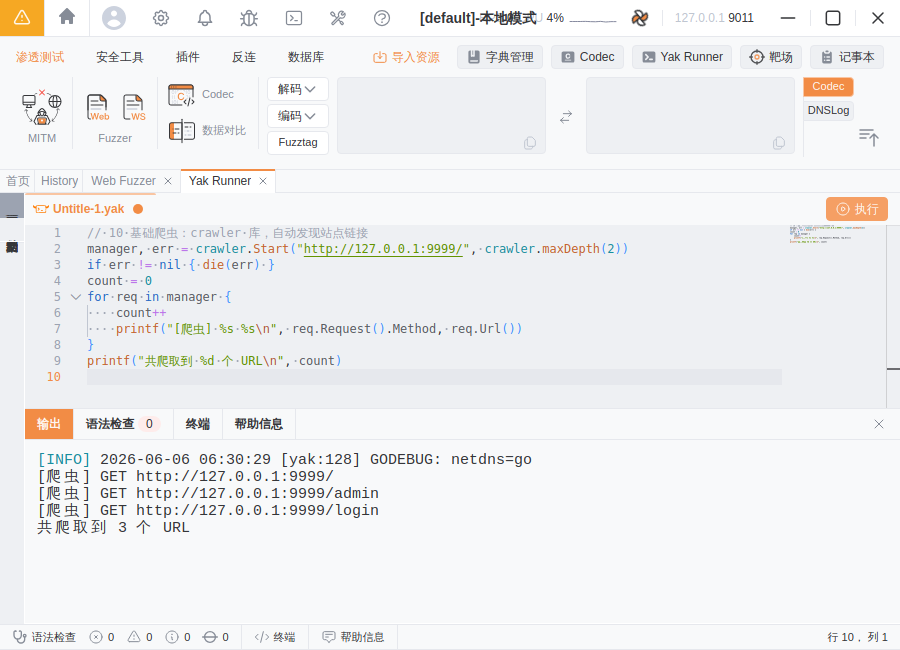

---

### 10.11 与 GUI 联动：yakit 库

`yakit.Info / yakit.Warn / yakit.Error` 会把日志按级别输出到 Yakit 的输出面板（写插件时用它向用户汇报进度）。

```go
yakit.Info("开始执行任务……")
yakit.Info("目标: %s", "127.0.0.1:9999")

rsp, _, err = poc.Get("http://127.0.0.1:9999/")
if err != nil {
    yakit.Error("请求失败: %v", err)
} else {
    yakit.Info("请求成功，状态码 %d", rsp.GetStatusCode())
}
yakit.Warn("任务结束（这是一条告警示例）")
```

运行结果（不同级别日志带颜色区分）：

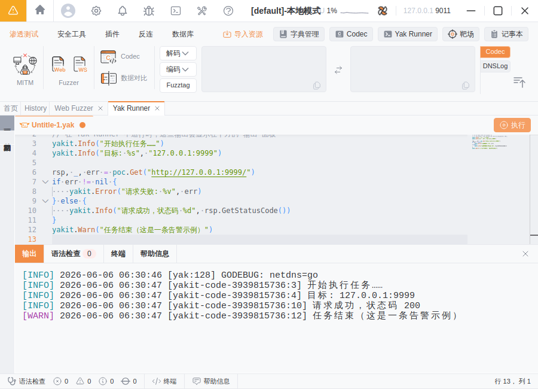

---

### 10.12 Yaklang 语法速查表

| 主题 | 写法 | 说明 |
| --- | --- | --- |
| 变量 | `a = 1` | 无需声明类型，自动推断 |
| 字符串 | `"双引号"` / `` `反引号(多行)` `` | 反引号支持多行原始字符串 |
| 注释 | `// 单行`，`/* 多行 */` | 与 Go 一致 |
| 切片 | `s = [1,2,3]`；`append(s, 4)` | `len(s)` 取长度 |
| 字典 | `m = {"k": "v"}`；`m["k"]` | — |
| 遍历切片 | `for e in s { }` | **单变量=元素** |
| 带下标遍历 | `for i=0; i<len(s); i++ { s[i] }` | for-in 双变量对切片**不给**下标 |
| 遍历 map | `for k, v in m { }` | 键, 值 |
| 数字循环 | `for i=1; i<=5; i++ { }` | **不支持** `1..5` / `range()` |
| 条件 | `if a>b { } else { }` | 条件不用加括号 |
| 分支 | `switch x { case 1: ... default: ... }` | — |
| 函数 | `func f(a,b){ return a+b }` | 支持多返回值 |
| 匿名函数 | `g = func(x){ return x*x }` | 闭包 |
| 错误处理 | `if err != nil { die(err) }` | 或 `try { } catch e { }` |
| 并发 | `go func(){ }()` + `sync.NewWaitGroup()` | `wg.Add/Done/Wait` |
| 发包 | `poc.Get(url)` / `poc.HTTP(raw)` | 返回 `rsp, req, err` |
| 模糊测试 | `fuzz.Strings("{{int(1-3)}}")` | fuzztag 渲染/发包 |
| 端口扫描 | `servicescan.Scan(host, ports)` | 带指纹识别 |
| 爬虫 | `crawler.Start(url)` | — |
| 编码 | `codec.EncodeBase64/Md5/EncodeUrl` | 编码与哈希 |
| 字符串库 | `str.TrimSpace/ToUpper/Split/Contains` | — |
| 日志输出 | `yakit.Info/Warn/Error(...)` | 输出到 GUI 面板 |

> 更多标准库与函数可在 Yak Runner 中输入库名加 `.` 触发**自动补全**，或查阅[官方文档](https://yaklang.com/)。

---

## 11. 反连服务器（Reverse Server）

很多漏洞（SSRF、RCE、XXE、反序列化）需要"带外（OOB）"验证。Yakit 内置反连服务器：

- **单端口多协议识别**：一个端口同时识别 HTTP / DNS / RMI / LDAP / ICMP 等协议。
- **DNSLog**：生成临时域名，用于探测 SSRF/盲注的回连。
- **反弹 Shell 接收**：以类 SSH 的体验接收和管理反弹回来的 Shell。
- **Yso / 利用链**：配合反序列化利用生成 payload 并接收回连。

使用时在「反连服务器」配置监听公网地址/端口，把生成的回连地址放进你的 payload，触发后即可在面板看到回连记录。

「反连」菜单下提供 **反连触发器（DNS/ICMP/TCP）、RevHack(Yso)、端口监听器** 等。下图是 **DNSLog** 页面：点「生成一个可用域名」拿到临时域名，目标一旦解析/访问该域名，下方表格就会出现 **域名 / 类型 / 远端 IP / Timestamp** 记录（适合验证 SSRF、盲注等带外漏洞）：


> ⚠️ 内置 DNSLog 依赖外部服务，在仅放行 GitHub 的离线环境中无法生成域名，但页面与配置流程如上所示。

---

## 12. 常见问题 FAQ

**Q1：启动后卡在"连接引擎/下载引擎"？**
A：多为网络问题（无法访问引擎下载源）。可手动下载 `yak` 引擎放到 `~/yakit-projects/yak-engine/yak` 并赋可执行权限，或手动 `./yak grpc` 后用 Yakit 远程连接。

**Q2：HTTPS 抓不到包 / 浏览器报证书错误？**
A：说明 CA 证书没被信任。优先用 MITM 的「免配置启动 Chrome」；或手动把 CA 证书装进系统「受信任的根证书颁发机构」，并确认浏览器代理指向了 MITM 端口。

**Q3：抓不到任何包？**
A：检查浏览器/系统代理是否设置为 `127.0.0.1:8083`（与 MITM 监听端口一致）；确认 MITM 已点"启动/劫持开启"。

**Q4：Linux 下 AppImage 启动报沙箱错误？**
A：加 `--no-sandbox` 参数启动，或安装 `libfuse2`。

**Q5：引擎和 GUI 版本不一致有影响吗？**
A：建议使用 Yakit 自动匹配的引擎版本。版本差异较大时部分新功能可能不可用，必要时在引擎管理里切换/更新版本。

---

## 13. 运行与验证说明（如何在离线环境跑起来）

> 本节如实记录本指南的**实测方法**——前面各章节的截图全部来自这次真实运行，而非示意图。

### 13.1 环境与离线方案

本指南是在一个**网络受限的 Linux 沙箱环境**中编写并实测的。该环境只放行了 GitHub，**屏蔽了 yaklang.com 及其阿里云 OSS 下载源**，因此 Yakit 自带的"在线安装引擎 / 在线插件商店"无法使用。为了真正把 Yakit 跑起来，采用了官方支持的**离线 / 手动连接引擎**方案：

1. 从 **GitHub Releases** 下载 Yakit GUI（`Yakit-1.4.7-0605-linux-amd64.AppImage`）与匹配的 yak 引擎（`yak_linux_amd64`，`v1.4.7-beta8`）。
2. 把引擎二进制放到 Yakit 默认查找路径 `~/yakit-projects/yak-engine/yak` 并赋可执行权限。
3. 在无显示器的服务器上用 **Xvfb 虚拟显示** 启动 Yakit Electron 客户端（`--no-sandbox`），用 `scrot` 截图、`xdotool` 模拟操作、`xclip` 粘贴代码。
4. Yakit 启动后通过本地引擎自动连接（`本地模式`，`127.0.0.1:9011`），引擎内置的 **37 个核心插件全部离线加载成功**。
5. 起一个本地靶子 `python3 -m http.server 9999` 作为发包/扫描/爬虫的合法测试目标。

### 13.2 实测验证清单

| 功能 | 验证结果 | 对应截图所在章节 |
| --- | --- | --- |
| 引擎连接 / 项目管理 | ✅ 本地模式连接成功 | [§4](#4-首次启动与连接引擎) |
| 主界面 / 本地插件加载 | ✅ 37 个本地插件就绪 | [§5](#5-核心功能速览) |
| MITM 配置 / 启动 / 抓包 | ✅ 经代理抓到 6 条流量 | [§6](#6-实战一mitm-劫持替代-burpsuite) |
| MITM 手动拦截 / 改包 / 放行 | ✅ 拦下并放行真实请求 | [§6.3](#63-拦截--放行--历史) |
| Web Fuzzer 单次发包 | ✅ 真实 `200 OK` 响应 | [§7.1](#71-基本用法重放) |
| Web Fuzzer 模糊测试 | ✅ fuzztag 展开发出 5 个请求 | [§7.3](#73-结果分析) |
| 本地插件 / 专项漏洞检测 | ✅ 离线插件可用 | [§8](#8-实战三插件商店与插件使用) · [§9](#9-实战四专项漏洞扫描) |
| Yak Runner / Yaklang 11 个示例 | ✅ 全部成功运行并截图 | [§10](#10-实战五yak-runner-与-yaklang-语法详解含逐例截图) |
| 在线插件商店 / DNSLog 域名生成 | ⚠️ 受网络策略限制不可用 | [§8](#8-实战三插件商店与插件使用) · [§11](#11-反连服务器reverse-server) |

> ✅ **结论**：在仅放行 GitHub 的受限环境中，通过"手动下载引擎 + 本地连接"的离线方式，Yakit 的**引擎连接、项目管理、MITM 全流程、Web Fuzzer 发包与模糊测试、本地插件、Yak Runner 编程**等核心功能均**真实跑通**；只有"在线插件商店 / 在线装引擎 / 内置 DNSLog 域名生成"因下载源被网络策略拦截而不可用——这属于环境限制，**并非 Yakit 本身的问题**。

---

## 14. 法律与合规声明

⚠️ **Yakit 是渗透测试 / 安全研究工具，威力强大，请务必合法合规使用：**

- 仅可对你**拥有合法授权**的系统进行测试（你自己的环境、获得书面授权的目标、或专门的靶场/CTF）。
- **严禁**在未授权的情况下对任何第三方系统进行抓包、扫描、爆破、漏洞利用等行为——这在绝大多数国家和地区都属于**违法行为**。
- 学习练习请使用合法靶场，例如 DVWA、Pikachu、本地搭建的测试站点等。
- 使用本工具产生的一切后果由使用者自行承担。

---

## 15. 参考链接

- Yakit GitHub 仓库：https://github.com/yaklang/yakit
- Yakit 官网 / 官方文档：https://yaklang.com/
- 功能介绍：https://yaklang.com/products/intro/
- 下载与安装：https://yaklang.com/products/download_and_install
- 证书安装与免配置启动：https://yaklang.com/products/mitm/hijack-configuration/
- 专项漏洞检测：https://yaklang.com/products/special/
- yak 引擎（Yaklang）仓库：https://github.com/yaklang/yaklang

---

> 本指南由社区整理，内容以官方最新文档为准。欢迎补充与纠错。
