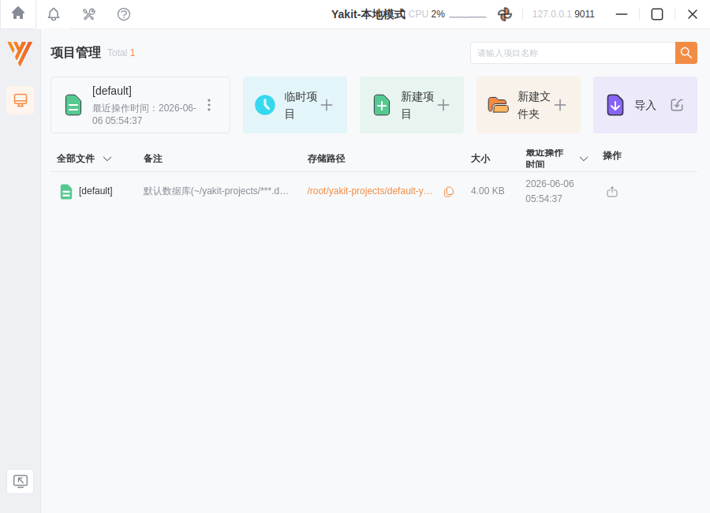
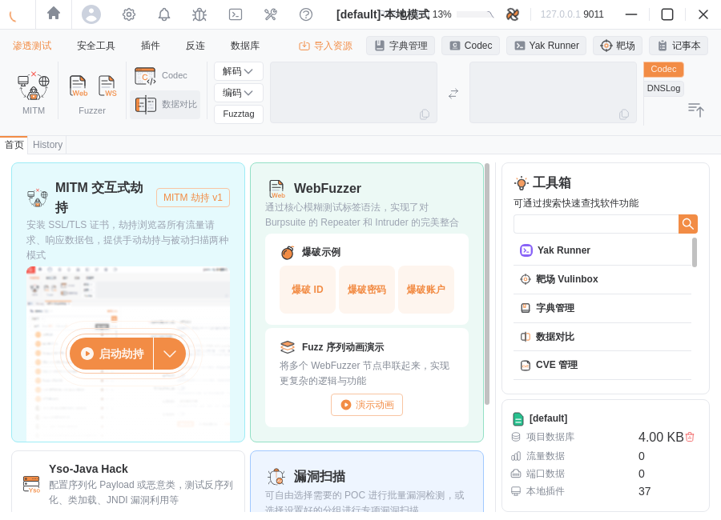
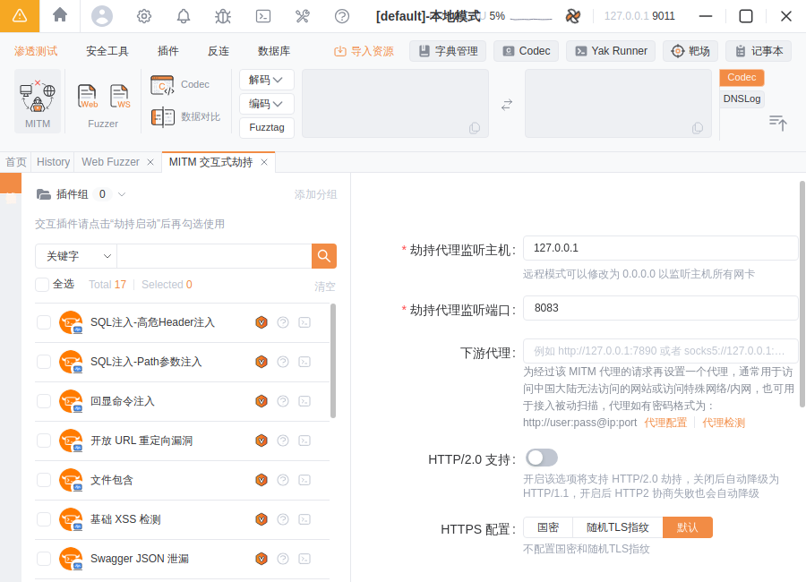
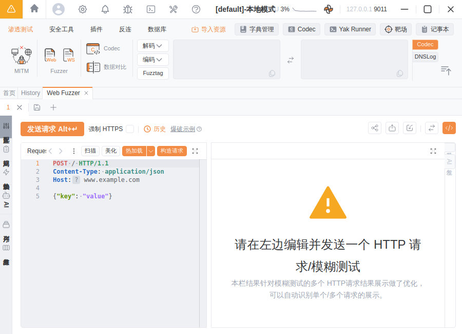
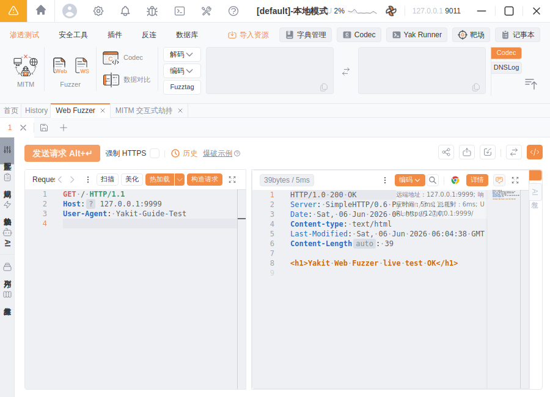

# Yakit 使用指南（中文）

> 一份面向初学者、简单易懂的 Yakit 上手教程。内容整理自 [Yakit 官方文档](https://yaklang.com/) 与 [GitHub 官方仓库](https://github.com/yaklang/yakit)，并配有在本环境中实际运行 Yakit 引擎的测试截图。

---

## 目录

1. [Yakit 是什么](#1-yakit-是什么)
2. [核心架构：GUI + 引擎](#2-核心架构gui--引擎)
3. [下载与安装](#3-下载与安装)
4. [首次启动与连接引擎](#4-首次启动与连接引擎)
5. [核心功能速览](#5-核心功能速览)
6. [实战一：MITM 劫持（替代 BurpSuite）](#6-实战一mitm-劫持替代-burpsuite)
7. [实战二：Web Fuzzer 与 Fuzztag](#7-实战二web-fuzzer-与-fuzztag)
8. [实战三：插件商店与插件使用](#8-实战三插件商店与插件使用)
9. [实战四：专项漏洞扫描](#9-实战四专项漏洞扫描)
10. [实战五：Yak Runner 写脚本](#10-实战五yak-runner-写脚本)
11. [反连服务器（Reverse Server）](#11-反连服务器reverse-server)
12. [常见问题 FAQ](#12-常见问题-faq)
13. [测试截图：在本环境运行 Yakit](#13-测试截图在本环境运行-yakit)
14. [法律与合规声明](#14-法律与合规声明)
15. [参考链接](#15-参考链接)

---

## 1. Yakit 是什么

**Yakit** 是由 yaklang 团队开发的一款**网络安全一体化（ALL-IN-ONE）平台**，可以理解为「国产、开源、可编程的 BurpSuite」。它把渗透测试中常用的能力整合到一个图形化客户端里，覆盖从**抓包改包**到**漏洞挖掘**的完整流程：

- 🔍 **MITM 中间人劫持**：拦截、查看、修改 HTTP/HTTPS 流量，号称可 100% 替代 BurpSuite 的核心功能。
- ⚡ **Web Fuzzer**：全球首个**可视化** Web 模糊测试工具，支持爆破、Intruder、目录扫描等。
- 🧩 **插件生态**：内置插件商店，可一键安装社区插件，也支持自己编写 Yak 脚本插件。
- 🐞 **专项漏洞检测**：针对常见中间件、CMS、框架、组件的 PoC/EXP 批量扫描。
- 🔁 **反连服务器**：单端口多协议识别（HTTP/DNS/RMI/LDAP…）、反弹 Shell 接收、DNSLog。
- 🛠️ **Yak Runner**：内置专为安全设计的编程语言 **Yaklang（CDSL，网络安全领域专用语言）** 的代码编辑/运行环境。

Yakit 是**开源免费**的（GitHub 仓库 [yaklang/yakit](https://github.com/yaklang/yakit)），支持 **Windows / macOS / Linux** 三大平台。

---

## 2. 核心架构：GUI + 引擎

理解 Yakit 的架构是用好它的前提。Yakit 采用 **gRPC 的客户端-服务端（C/S）架构**，由两部分组成：

```
┌─────────────────────────┐        gRPC         ┌──────────────────────────┐
│      Yakit（GUI 客户端）   │  <───────────────>  │   yak 引擎（gRPC 服务端）    │
│  Electron 图形界面，负责展示 │     本地或远程连接      │  Yaklang 虚拟机，真正干活的核心  │
└─────────────────────────┘                     └──────────────────────────┘
```

- **Yakit（前端）**：你看到的图形界面，本身**不执行**扫描/抓包逻辑，只负责"下指令、看结果"。
- **yak 引擎（后端）**：一个独立的可执行文件（`yak`），内部是 Yaklang 的栈式虚拟机，所有抓包、扫描、Fuzz 都由它完成。
- 两者通过 **gRPC** 通信，因此引擎既可以**跑在本地**，也可以部署在**远程服务器**上，再用本地 Yakit 连过去。

> 💡 **关键点**：第一次启动 Yakit 时，如果本地没有引擎，它会提示你**下载/安装引擎**；之后每次启动都需要先「连接引擎」才能使用全部功能。

---

## 3. 下载与安装

### 3.1 官方下载地址

| 渠道 | 地址 |
| --- | --- |
| 官网下载页 | https://yaklang.com/products/download_and_install |
| GitHub Releases | https://github.com/yaklang/yakit/releases |

在 Releases 里按平台选择安装包（以 `v1.4.7-0605` 为例）：

| 平台 | 安装包文件名（示例） |
| --- | --- |
| Windows | `Yakit-1.4.7-0605-windows-amd64.exe` |
| macOS (Apple Silicon) | `Yakit-1.4.7-0605-darwin-arm64.dmg` |
| macOS (Intel) | `Yakit-1.4.7-0605-darwin-x64.dmg` |
| Linux | `Yakit-1.4.7-0605-linux-amd64.AppImage` |

> 🪟 **Windows 老旧系统 / 🍎 老旧 macOS / 🐧 老旧 Linux** 请选择带 `legacy` 字样的安装包。

### 3.2 各平台安装方式

- **Windows**：双击 `.exe` 安装包，按提示安装即可（普通用户安装，无需管理员）。
- **macOS**：打开 `.dmg`，把 Yakit 拖入「应用程序」。若提示"已损坏/无法验证开发者"，在「系统设置 → 隐私与安全性」点击"仍要打开"，或执行：
  ```bash
  sudo xattr -rd com.apple.quarantine /Applications/Yakit.app
  ```
- **Linux**：`.AppImage` 免安装，赋予可执行权限后直接运行：
  ```bash
  chmod +x Yakit-1.4.7-0605-linux-amd64.AppImage
  ./Yakit-1.4.7-0605-linux-amd64.AppImage --no-sandbox
  ```

---

## 4. 首次启动与连接引擎

第一次打开 Yakit，会经历下面几步（界面会自动引导）：

1. **同意用户协议**：阅读并勾选同意。
2. **安装/检测引擎**：
   - Yakit 检测本地是否已有 `yak` 引擎。没有时会弹出**「安装引擎」**按钮，点一下自动下载（默认从官方源下载，国内有镜像）。
   - 引擎默认安装在用户目录下的 `yakit-projects/yak-engine/yak`。
3. **启动并连接引擎**：
   - 下载完成后点击 **「启动引擎」/「本地连接」**，Yakit 会在本地拉起 `yak grpc` 服务并自动连上。
   - 也可以选择 **「远程连接」**，填写远程引擎的 `Host / Port / 证书 / 密钥` 来连接部署在服务器上的引擎。
4. **进入主界面**：连接成功后即可看到顶部菜单栏（安全工具、MITM、Web Fuzzer、插件、Yak Runner 等）。

> 🛠️ **手动启动引擎（进阶 / 离线环境）**
> 如果你已经单独下载了 `yak` 引擎二进制，可以手动启动 gRPC 服务，再让 Yakit「远程连接 / 本地连接」到它：
> ```bash
> # 赋权
> chmod +x ./yak
> # 启动 gRPC 服务（默认端口 8087），首次会初始化本地数据库
> ./yak grpc --host 127.0.0.1 --port 8087
> ```
> 本指南末尾的[测试截图](#13-测试截图在本环境运行-yakit)就是用这种方式在受限网络环境中把引擎跑起来的。

---

## 5. 核心功能速览

启动后，顶部/侧边的主要功能区如下（不同版本菜单略有差异）：

| 模块 | 作用 | 类比 BurpSuite |
| --- | --- | --- |
| **MITM 交互式劫持** | 抓包、改包、放行、历史流量 | Proxy + Intercept |
| **History（历史）** | 所有经过代理的请求列表，可检索、回放 | HTTP history |
| **Web Fuzzer** | 自定义原始请求 + 模糊测试/爆破 | Repeater + Intruder |
| **插件商店 / 本地插件** | 安装、运行、管理 Yak 插件 | Extensions/BApp |
| **专项漏洞检测** | 中间件/CMS/框架 PoC 批量扫描 | 主动扫描 |
| **端口/资产扫描** | 端口扫描、指纹识别、空间引擎 | — |
| **反连服务器** | DNSLog、反弹 Shell、协议识别 | Collaborator |
| **Yak Runner** | 编写运行 Yaklang 脚本 | — |
| **Payload 字典** | 管理爆破字典 | Payloads |

---

## 6. 实战一：MITM 劫持（替代 BurpSuite）

MITM（中间人）是 Yakit 最常用的功能：它在本地启动一个 HTTP 代理，浏览器流量经过它时即可被拦截、查看、修改。

### 6.1 启动 MITM 代理

1. 顶部菜单进入 **「MITM 交互式劫持」**。
2. 设置 **劫持代理监听地址**，默认 `127.0.0.1:8083`（端口可改）。
3. 点击 **「劫持已开启 / 启动」**。

### 6.2 安装 CA 证书（解密 HTTPS）

要抓 HTTPS 流量，浏览器需要信任 Yakit 的 CA 证书。两种方式：

- ✅ **免配置启动（推荐新手）**：Yakit 提供"免配置启动 Chrome"功能（MITM 页面 → 右上角浏览器图标），它会拉起一个**已自动信任证书、已设置好代理**的临时 Chrome，开箱即用，无需手动装证书。
- 🔧 **手动安装证书**：
  1. 在 MITM 劫持页的「**高级配置 / 下载证书**」处下载 CA 证书（`.crt`）。
  2. Windows：双击证书 → 安装到 **「受信任的根证书颁发机构」**。
  3. macOS：导入「钥匙串」并设为「始终信任」。
  4. 浏览器/系统设置 HTTP 代理为 `127.0.0.1:8083`（与上一步监听端口一致）。

### 6.3 拦截 → 放行 → 历史

- **拦截（Hijack）**：开启劫持后，每个请求会被"挂起"，你可以在请求框里直接编辑，然后：
  - **放行（Forward）**：转发当前这个包。
  - **丢弃（Drop）**：丢掉这个包。
  - **放行所有 / 自动放行**：暂停手动拦截，让流量自动通过（这时相当于被动记录模式）。
- **History（历史记录）**：所有经过代理的请求都会记录在下方列表，支持按 URL、状态码、关键字过滤检索，点开可看完整请求/响应。

### 6.4 三个高频进阶能力

- **替换规则 / 标记（Replacer）**：用正则自动替换请求或响应中的内容（如统一替换 Header、给响应染色标记），便于批量处理与定位。
- **热加载（Hot-loading）**：在 MITM 页面直接写一段 Yak 脚本，对**每个**经过的请求/响应做自定义处理（如自动解密、自动加签名），改完即生效，无需重启。
- **被动扫描插件**：在 MITM 开启时挂载被动扫描插件，浏览网站的同时自动对流量做漏洞检测。

### 6.5 发送到 Web Fuzzer

在 History 或拦截框里，右键某个请求 → **「发送到 Web Fuzzer」**，即可把这个请求丢进 Fuzzer 做进一步的重放和爆破（见下一节）。这就是经典的 **拦截 → History → Repeater/Intruder** 工作流。

---

## 7. 实战二：Web Fuzzer 与 Fuzztag

Web Fuzzer 是 Yakit 的"杀手锏"，把 BurpSuite 的 Repeater（重放）和 Intruder（爆破）合二为一，而且是**可视化**的。

### 7.1 基本用法（重放）

1. 进入 **「Web Fuzzer」**，左侧粘贴/编辑一个**原始 HTTP 请求**（Raw 报文）。
2. 点击 **「发送」**，右侧立刻显示响应。
3. 引擎会**自动修复** `Content-Length`、`Content-Type`、`CRLF`、分块编码等细节，你专注改 payload 即可。

### 7.2 Fuzztag：可视化模糊测试的核心语法

Fuzztag 用 `{{...}}` 包裹，发送时会被**自动展开**成多个请求。常用标签：

| Fuzztag | 含义 | 示例展开 |
| --- | --- | --- |
| `{{int(1-100)}}` | 数字遍历（如遍历 ID） | 1,2,3,…,100 |
| `{{int(1-100\|4)}}` | 数字遍历并补零到 4 位 | 0001,0002,… |
| `{{file(/path/dict.txt)}}` | 从字典文件逐行取值 | 字典里的每一行 |
| `{{x(payload名)}}` | 引用 Payload 字典 | 字典内容 |
| `{{net(192.168.1.1/24)}}` | IP 段遍历 | 各个 IP |
| `{{rand_int(1,100)}}` | 随机数 | 随机 |
| `{{base64(...)}}` | 对内容做 base64 编码 | 编码后的串 |
| `{{date()}}` | 当前时间 | 时间戳 |

**典型场景：**

- **爆破登录密码**：把请求体里的密码改成
  ```
  password={{file(/path/to/passwords.txt)}}
  ```
  发送后，每行字典各发一个请求，在结果表里按**响应长度/状态码**排序即可发现异常项。

- **遍历越权 ID（IDOR）**：
  ```
  GET /api/user/{{int(1000-1100)}} HTTP/1.1
  ```

- **多参数笛卡尔积**：同时给用户名和密码加 Fuzztag，Yakit 会自动做笛卡尔积组合，相当于 Intruder 的 Cluster Bomb 模式。

### 7.3 结果分析

发送后下方是结果表格，可按 **响应状态码、响应长度、耗时、关键字匹配** 排序和过滤，快速定位"与众不同"的响应——这通常就是漏洞点或正确凭据。

---

## 8. 实战三：插件商店与插件使用

Yakit 的能力很大一部分来自插件（用 Yaklang 编写）。

1. 进入 **「插件商店」**，可以浏览、搜索社区插件，点击 **「下载/安装」**。
2. 已安装插件在 **「本地插件 / 我的插件」** 里管理。
3. 插件分几类：
   - **MITM/被动扫描插件**：挂在 MITM 上自动检测。
   - **端口扫描/指纹插件**：识别资产与组件。
   - **PoC/漏洞插件**：针对特定漏洞做检测/利用。
4. 也可以点 **「新建插件」** 自己写一个，支持热加载调试。

> ⚠️ 在受限网络环境（无法访问插件源）下，插件商店列表可能为空或无法下载，但**本地内置功能（MITM、Web Fuzzer、Yak Runner）不受影响**。

---

## 9. 实战四：专项漏洞扫描

Yakit 的「专项漏洞检测」针对常见目标做精准 PoC 扫描：

1. 进入 **「专项漏洞检测 / 漏洞检测」** 模块。
2. 输入目标（URL / IP / 资产列表）。
3. 选择要使用的 PoC 类型（按中间件、CMS、框架、组件筛选，例如 Shiro、Struts2、Weblogic、Log4j 等）。
4. 点击开始，结果会列出命中的漏洞与详情，可导出报告。

> 也可结合「端口/资产扫描」先做资产测绘（端口、服务指纹、Web 指纹），再针对性地选 PoC 扫描。

---

## 10. 实战五：Yak Runner 写脚本

Yak Runner 是内置的 Yaklang 代码编辑/运行环境，适合做自动化与自定义工具。Yaklang 语法类似 Go + Python，内置大量安全相关的标准库。

一个最小示例（发起一次 HTTP 请求并打印响应）：

```go
// hello.yak
rsp, req, err = poc.Get("https://example.com")
if err != nil {
    die(err)
}
println(string(rsp.RawPacket))
```

也可以用引擎命令行直接跑脚本（无需 GUI）：

```bash
./yak run hello.yak
# 或进入交互式解释器
./yak
```

更多标准库（`poc`、`http`、`fuzz`、`servicescan`、`crawler` 等）见官方文档。

---

## 11. 反连服务器（Reverse Server）

很多漏洞（SSRF、RCE、XXE、反序列化）需要"带外（OOB）"验证。Yakit 内置反连服务器：

- **单端口多协议识别**：一个端口同时识别 HTTP / DNS / RMI / LDAP / ICMP 等协议。
- **DNSLog**：生成临时域名，用于探测 SSRF/盲注的回连。
- **反弹 Shell 接收**：以类 SSH 的体验接收和管理反弹回来的 Shell。
- **Yso / 利用链**：配合反序列化利用生成 payload 并接收回连。

使用时在「反连服务器」配置监听公网地址/端口，把生成的回连地址放进你的 payload，触发后即可在面板看到回连记录。

---

## 12. 常见问题 FAQ

**Q1：启动后卡在"连接引擎/下载引擎"？**
A：多为网络问题（无法访问引擎下载源）。可手动下载 `yak` 引擎放到 `~/yakit-projects/yak-engine/yak` 并赋可执行权限，或手动 `./yak grpc` 后用 Yakit 远程连接。

**Q2：HTTPS 抓不到包 / 浏览器报证书错误？**
A：说明 CA 证书没被信任。优先用 MITM 的「免配置启动 Chrome」；或手动把 CA 证书装进系统「受信任的根证书颁发机构」，并确认浏览器代理指向了 MITM 端口。

**Q3：抓不到任何包？**
A：检查浏览器/系统代理是否设置为 `127.0.0.1:8083`（与 MITM 监听端口一致）；确认 MITM 已点"启动/劫持开启"。

**Q4：Linux 下 AppImage 启动报沙箱错误？**
A：加 `--no-sandbox` 参数启动，或安装 `libfuse2`。

**Q5：引擎和 GUI 版本不一致有影响吗？**
A：建议使用 Yakit 自动匹配的引擎版本。版本差异较大时部分新功能可能不可用，必要时在引擎管理里切换/更新版本。

---

## 13. 测试截图：在本环境运行 Yakit

> **运行说明（如实记录）**：本指南是在一个**网络受限的 Linux 沙箱环境**中编写并实测的。该环境只放行了 GitHub，**屏蔽了 yaklang.com 及其阿里云 OSS 下载源**，因此 Yakit 自带的"在线安装引擎 / 插件商店在线下载"无法使用。为了真正把 Yakit 跑起来，我采用了官方支持的**离线/手动连接引擎**方案：
>
> 1. 从 GitHub Releases 下载 Yakit GUI（`Yakit-1.4.7-0605-linux-amd64.AppImage`）与匹配的 yak 引擎（`yak_linux_amd64`，v1.4.7-beta8）。
> 2. 把引擎二进制放到 Yakit 默认查找路径 `~/yakit-projects/yak-engine/yak`。
> 3. 在无显示器的服务器上用 **Xvfb 虚拟显示** 启动 Yakit Electron 客户端，并用 `scrot` 截图。
> 4. Yakit 启动后通过本地引擎自动连接（`本地模式`，`127.0.0.1:9011`），引擎内置的 **37 个核心插件全部离线加载成功**。
>
> 下面是**实际运行截图**（非示意图）。

### ① 启动 / 连接引擎界面

首次启动 Yakit，可选择主题（亮色/暗色）与运行模式（经典 / 安全专家 / 扫描模式），点击 **「手动连接引擎」** 连接本地 yak 引擎。


### ② 项目管理

连接成功后进入**项目管理**。每个"项目"对应一个独立数据库（SQLite），可新建项目、临时项目或导入已有项目，流量与扫描结果都隔离存储。标题栏显示 `Yakit-本地模式`，已连接 `127.0.0.1:9011`。



### ③ 主界面（首页 Dashboard）

进入项目后即是主工作台：顶部是功能菜单（安全工具 / 插件 / 反连 / 数据库 / 字典管理 / Codec / Yak Runner / 靶场 / 记事本），中间是 **MITM 交互式劫持**、**WebFuzzer**、**工具箱**（Yak Runner、靶场 Vulinbox、CVE 管理…）等入口。右下角显示 **本地插件 37** 个，证明引擎已离线就绪。



### ④ MITM 交互式劫持配置

MITM 页面左侧是**被动扫描插件列表**（SQL 注入、命令注入、XSS 检测、文件包含、开放重定向、Swagger 泄漏等，共 17 个），右侧可配置**劫持代理监听主机/端口**（默认 `127.0.0.1:8083`）、下游代理、HTTP/2.0、HTTPS 配置等。



### ⑤ Web Fuzzer 编辑器

Web Fuzzer 左侧编辑**原始 HTTP 请求**，右侧展示响应。支持 `强制 HTTPS`、`热加载`、`构造请求`、`爆破示例`、`Fuzztag` 等能力。



### ⑥ Web Fuzzer 实战发包（真实测试）✅

为了验证端到端链路真的能工作，我在本机起了一个测试 HTTP 服务（`python3 -m http.server 9999`），在 Web Fuzzer 里编辑请求并点击 **「发送请求」**：

```http
GET / HTTP/1.1
Host: 127.0.0.1:9999
User-Agent: Yakit-Guide-Test
```

Yakit 成功发包并在右侧渲染了**真实响应**：`HTTP/1.0 200 OK`、`Server: SimpleHTTP/0.6`、`Content-Length: 39`、响应体 `<h1>Yakit Web Fuzzer live test OK</h1>`，耗时 **5ms**、远端地址 `127.0.0.1:9999`。本机测试服务的访问日志中也同步出现了这条 `"GET / HTTP/1.1" 200` 记录——**确认 Yakit GUI → yak 引擎 → 目标服务的完整链路真实跑通**。



> ✅ **结论**：在仅放行 GitHub 的受限环境中，通过"手动下载引擎 + 本地连接"的离线方式，Yakit 的**引擎连接、项目管理、MITM 配置、Web Fuzzer 真实发包**等核心功能均成功运行；仅"在线插件商店/在线装引擎"因下载源被墙而不可用（这属于网络策略限制，非 Yakit 本身问题）。

---

## 14. 法律与合规声明

⚠️ **Yakit 是渗透测试 / 安全研究工具，威力强大，请务必合法合规使用：**

- 仅可对你**拥有合法授权**的系统进行测试（你自己的环境、获得书面授权的目标、或专门的靶场/CTF）。
- **严禁**在未授权的情况下对任何第三方系统进行抓包、扫描、爆破、漏洞利用等行为——这在绝大多数国家和地区都属于**违法行为**。
- 学习练习请使用合法靶场，例如 DVWA、Pikachu、本地搭建的测试站点等。
- 使用本工具产生的一切后果由使用者自行承担。

---

## 15. 参考链接

- Yakit GitHub 仓库：https://github.com/yaklang/yakit
- Yakit 官网 / 官方文档：https://yaklang.com/
- 功能介绍：https://yaklang.com/products/intro/
- 下载与安装：https://yaklang.com/products/download_and_install
- 证书安装与免配置启动：https://yaklang.com/products/mitm/hijack-configuration/
- 专项漏洞检测：https://yaklang.com/products/special/
- yak 引擎（Yaklang）仓库：https://github.com/yaklang/yaklang

---

> 本指南由社区整理，内容以官方最新文档为准。欢迎补充与纠错。
